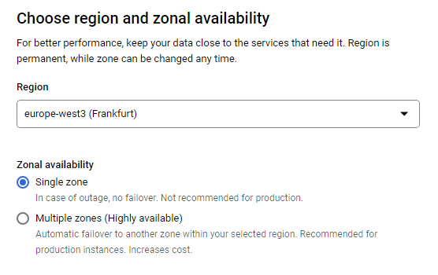

Google Cloud operation
================================================================================

The application can be deplyed in Google Cloud for 

Setting up
================================================================================

Secret Manager
--------------------------------------------------------------------------------

Cloud Build
--------------------------------------------------------------------------------

Cloud Run
--------------------------------------------------------------------------------

Cloud Scheduler
--------------------------------------------------------------------------------

Identity Platform
--------------------------------------------------------------------------------
Enable Identity Platform

https://cloud.google.com/identity-platform/docs/quickstart-email-password

Identity-Aware Proxy (IAP)
--------------------------------------------------------------------------------

https://cloud.google.com/iap/docs/cloud-run-sign-in
https://cloud.google.com/iap/docs/enable-external-identities

To setup the access authorization:

https://hodo.dev/posts/post-30-gcp-cloudrun-iap/

Cloud SQL
--------------------------------------------------------------------------------

This step is necessary to store the data in a SQL database, which is available
online. To create the database instance, follow the steps as below. Take note
of the password to be used later.

.. image:: _static/images/cloud_sql_01.png
    :width: 400
    :align: center
    :alt: Creation of Google Cloud SQL, step 1

The configuration of the machine is open for the user to define. The constrain
on high-end and high-available machines are the operation costs. So in this
case a low-end machine can be preferred when costs of operation need to be under
a certain budget. The same applies to the storage capacity of the database.

For the Connections, define it as illustrated below

After the instance creation is complete, create a new user for the access.
Navigate to the instance and then `Users`. In sequence click on
`Add user account` so the following form will be displayed:

Next navigate to the `Connections` menu and then `Security`. Mark the option
to `Allow only SSL connections`. This will restart the instance, and once it is
available again, click on `Create Client Certificates`. Add a name in field
on the next form and then click `Create`. The following form will be displayed:

Download the 3 certificates and copy them to the proper SSL folder in the
project. Lastly, take note of the `Public IP Address`, which will be necessary
for the access.

The `article <https://towardsdatascience.com/sql-on-the-cloud-with-python-c08a30807661>`_
demonstrates how to create a instance, and can be used as support.

To opmize costs of operation, the `article <https://medium.com/google-cloud/save-money-by-scheduling-cloud-sql-7981e1b65ea3>`_
demonstrates how to run the database on a scheduled basis.